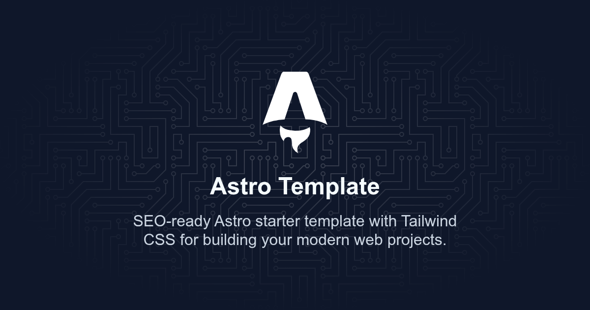

# Atro Template

## SEO-ready Astro starter template with Tailwind CSS for building your modern web projects.

[](https://github.com/rolodoom/astro-template)

## Status

[](https://raw.githubusercontent.com/rolodoom/astro-template/master/LICENSE)

## ✨ Features

- 🚀 Astro Starter Setup – Component-based architecture with ready-to-use pages and layouts.

- 🔍 SEO-ready – Pre-configured meta tags, Open Graph, and Twitter Cards for better search visibility.

- 🎨 Tailwind CSS Integration – Fully set up with responsive utilities and dark mode support.

- ⚡ Fast & Optimized – Pre-rendered pages, minimal bundle size, and image optimization.

## 🛠️ Tech Stack

- [Astro](https://astro.build/)
- [Tailwind CSS](https://tailwindcss.com/)

## 🚀 Getting Started

1. Create a new project using this template:

   ```bash
   pnpm create astro@latest -- --template rolodoom/astro-template
   ```

2. Go to your project folder and install dependencies:

   ```bash
   cd your-project-name
   pnpm i
   ```

3. Start the development server:

   ```bash
   pnpm dev
   ```

4. Open your browser and visit `http://localhost:4321` to see your project live.

## 🧞 Available Commands

All commands are run from the root of the project, from a terminal:

| Command                | Action                                           |
| :--------------------- | :----------------------------------------------- |
| `pnpm install`         | Installs dependencies                            |
| `pnpm dev`             | Starts local dev server at `localhost:4321`      |
| `pnpm build`           | Build your production site to `./dist/`          |
| `pnpm preview`         | Preview your build locally, before deploying     |
| `pnpm astro ...`       | Run CLI commands like `astro add`, `astro check` |
| `pnpm astro -- --help` | Get help using the Astro CLI                     |

## 📁 Project Structure

Inside of your Astro project, you'll see the following folders and files:

```text
/
├── public/
│   ├── favicon.svg
│   └── images/
│       └── cover.png
├── src/
│   └── components/
│       └── BaseHead.astro
│   └── layout/
│       └── Layout.astro
│   └── pages/
│       └── index.astro
│       └── 404.astro
│   └── styles/
│       └── global.css
└── package.json
```

Astro looks for `.astro` or `.md` files in the `src/pages/` directory. Each page is exposed as a route based on its file name.

Any static assets, like images, can be placed in the `public/` directory.

## 🔧 Configuration

### SEO Configuration

The template includes a `BaseHead.astro` component that handles all SEO-related meta tags. It supports:

- Title and description meta tags
- Open Graph meta tags for social sharing
- Twitter Card meta tags
- Canonical URL
- Favicon

### Astro config:

```js
// astro.config.mjs
export default defineConfig({
  site: "https://example.com/", // Replace with your own URL
});
```

🔧 Replace `"https://example.com/"` with your site’s URL before deploying.

### Tailwind Configuration

Tailwind CSS is pre-configured and ready to use. Customization can be done through the Astro configuration file (`astro.config.mjs`).

## 🐛 Bugs and Issues

Have a bug or an issue with this template? [Open a new issue](https://github.com/rolodoom/astro-template/issues) here on GitHub.

## 📝 License

This code in this repository is released under the [MIT](https://raw.githubusercontent.com/rolodoom/astro-template/master/LICENSE) license, which means you can use it for any purpose, even for commercial projects. In other words, do what you want with it. The only requirement with the MIT License is that the license and copyright notice must be provided with the software.
